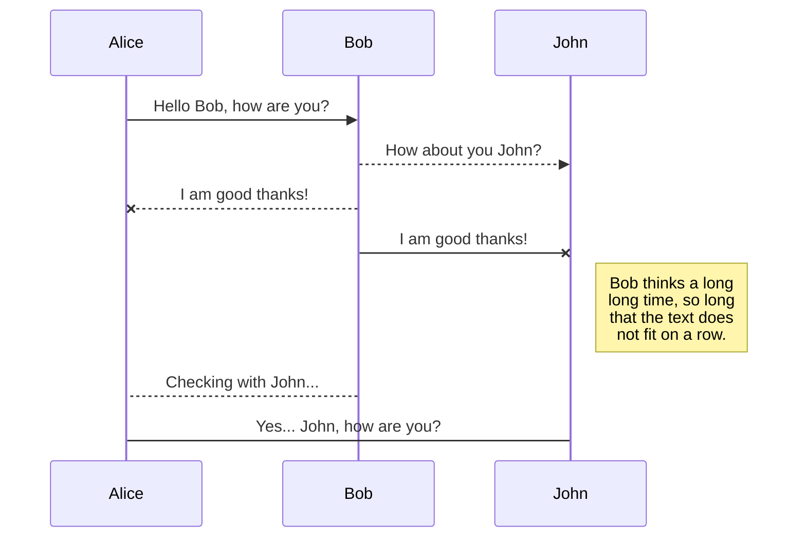
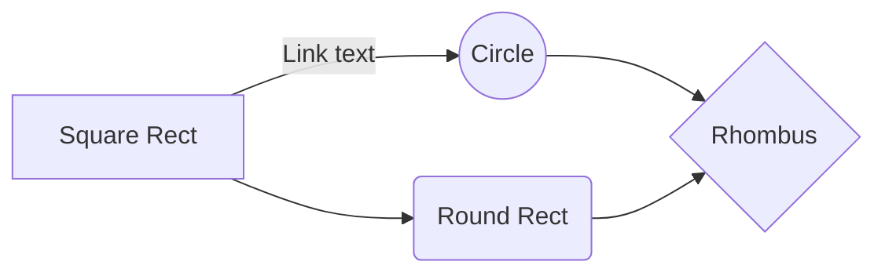

# FindCharge Today!

**Our Mission:**

The core goal of FindCharge is to locate nearby electric charging stations for any given vehicle. 

**Ok, but why?**

With the current trajectory of new electric vehicles coming to market rapidly growing, so will the charging stations. Besides Tesla owners, who have charging stations made for their cars, every EV(electric vehicle) owner knows the pain of spotting a charging station only to have the wrong connection. We aim to help EV owners, and Tesla owners, find their stations easily and not through trial and error.

# Technologies

- Backend
	- MongoDB
	- Mongoose
	- Express.js
	- Node.js
	- GraphQL
- Frontend
	- Apollo
	- React
	- Redux
	- TypeScript

## UML diagrams

You can render UML diagrams using [Mermaid](https://mermaidjs.github.io/). For example, this will produce a sequence diagram:

And this will produce a flow chart:

# MusaByte
