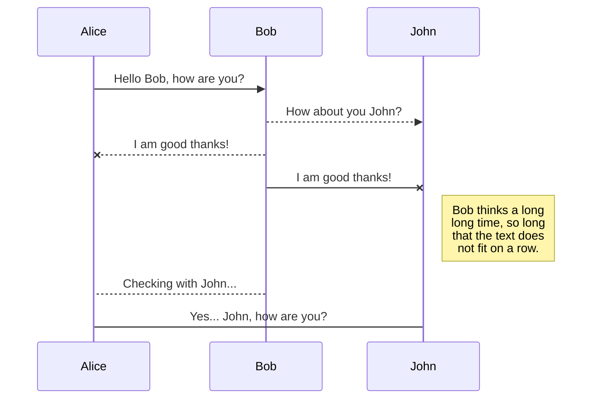
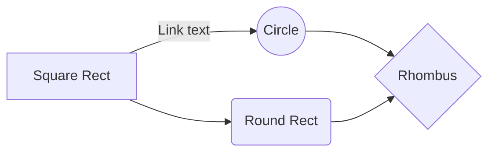

# MusaByte

**Mission**

To bring an interactive experience for music listeners everywhere!

**Ok, but why?**

Social media platforms like Instgram and Twitter, while effective for promoting an artist like myself, are flooded with content that in my opinion gets stale. Not to mention, anything that I could post on any social media platform would need to meet those platforms formats. For example, I could never create and post a game where fans compete in a quiz about the artist and the winner is the only person able to listen to an unreleased track, just as an example. While I could post a link to a static website, this results in a likely one time visit and a new website for each fan interaction. That's just a poor business model and not DRY code, lol iykyk. Instead I imagine a place where an artist like myself can claim their own place on the internet as the go to for their fans. 

# Technologies

- Backend
	- MongoDB
	- Mongoose
	- Express.js
	- Node.js
	- GraphQL
- Frontend
	- Apollo
	- React
	- Redux
	- TypeScript

## UML diagrams

You can render UML diagrams using [Mermaid](https://mermaidjs.github.io/). For example, this will produce a sequence diagram:

And this will produce a flow chart:

# MusaByte
